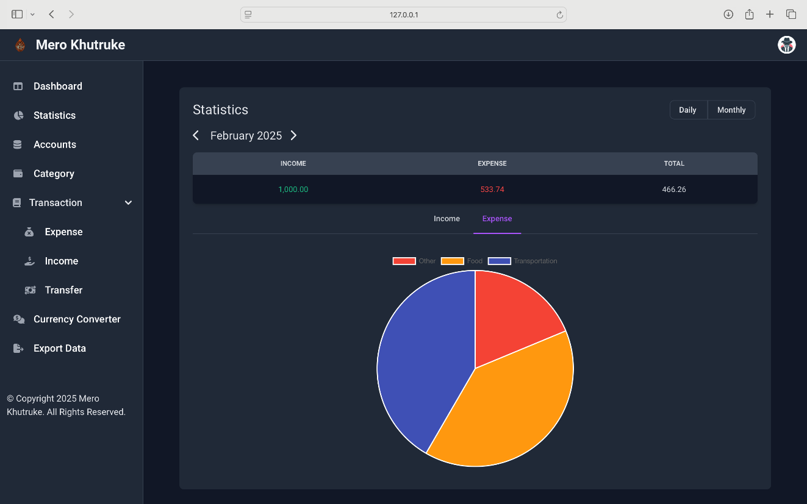

# Mero Khutruke - A Web-Based Personal Finance Manager

This repository contains the all the resources and the actual project for the partial fulfilment of the requirements for the degree of Bachelor in Information Technology (BIT). This project is submitted to Department of Information Technology, Central Campus of Technology, Dharan, Sunsari, Nepal. Our project is named Mero Khutruke.

## Team Members:

-   Darshan Shakya (BIT 343/077)
-   Sanjiv Rai (BIT 359/077)
-   Santosh Rai (BIT 361/077)

## How to use

-   Clone the repository with **git clone**
-   Copy .env.example file to .env and edit database credentials there (**cp .env.example .env**)
-   Run **composer install**
-   Run **php artisan key:generate**
-   Run **php artisan migrate --seed** (it has some seeded data for your testing)
-   Run **npm install**
-   Run **npm run dev** (to style the app and use hot reload feature of vite)
-   Launch the app

## Gallery

    
    
    
    
    
    
    
    
    
    
    
    
    
    
    
    
    
    
## License
The app is open-sourced software licensed under the [MIT license](https://opensource.org/license/mit).
